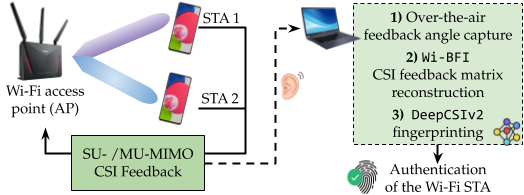

# DeepCSIv2
This is the implementation of the INFOCOM 25 Workshop's (DeepWireless 25) paper-- DeepCSIv2:[Radio Fingerprinting of Wi-Fi Devices Through
MIMO Compressed Channel Feedback](https://ieeexplore.ieee.org/abstract/document/11152893)


<br/>

### We present DeepCSIv2, a data-driven radio fingerprinting (RFP) algorithm to characterize Wi-Fi devices acting as stations (STAs) at the physical layer. DeepCSIv2 is based on a neural network architecture that automatically extracts the STA’s radio fingerprint from the feedback captured over the air and identifies the device.
<br/>

<p align="center">

</p>

If you find the project useful and you use this code, please cite our paper:
<br/>

```

@inproceedings{meneghello2025radio,
  title={Radio Fingerprinting of Wi-Fi Devices Through MIMO Compressed Channel Feedback},
  author={Meneghello, Francesca and Haque, Khandaker Foysal and Restuccia, Francesco},
  booktitle={IEEE INFOCOM 2025-IEEE Conference on Computer Communications Workshops (INFOCOM WKSHPS)},
  pages={1--6},
  year={2025},
  organization={IEEE}
}

```
<br/>
<br/>

### Extract the beamforming feedback with [Wi-BFI Tool](https://github.com/kfoysalhaque/Wi-BFI)
```bash
python main_extract_batch.py '<trace_dir>' '<standard>' '<MIMO>' '<Antenna-config>' '<BW>' '<packets to process>' '<vmatrices_dir>' '<bfa_dir>'
```
Example: python main_extract_batch.py /data/pcap_traces AX MU 4x2 80 5000 /data/output/vmatrices /data/output/bfa

### Beamforming feedback matrices dataset creation 
The following script creates the datasets of beamforming feedback matrices.
```bash
python create_dataset.py <'directory of input data'> <'number of different positions'> <'maximum number of samples to consider'> <'prefix to identify the data'> <'folder to save the dataset'> <'select random indices (`rand`) or subsample the data (`sampling`)'>
```
e.g., 
- python create_dataset.py ./input_files/ 3 6000 _ ./dataset/ sampling

### Train the learning algorithm for fingerprinting and test the performance
The following script allows training and testing DeepCSIv2 on the scenarios identified in the reference paper based on the arguments passed as input.
The fingerprinting is beamformee-specific: one model has to be trained using the feedback matrices collected from each of the beamformees.
```bash
python learning.py <'directory of the beamforming feedback matrices dataset'>  <'number of different positions'> <'name for the model to be saved'> <'number of transmitter antennas'> <'number of receiver antennas'> <'indices of the transmitter antennas to consider, comma separated'> <'indices of the receiver antennas to consider, comma separated'> <'bandwidth'> <'model type in {`convolutional`, `attention`}'> <'prefix to identify the data'> <'scenario considered in {S1, S2, S3, S4}'>
```
e.g., 
- python learning.py ./dataset/ 3 finger_ 4 2 0,1,2,3 0 160 attention _ S1
- python learning.py ./dataset/ 3 finger_ 4 2 0,1,2,3 0 160 attention_hyper_selection-128,128,128,128-7,7,7,5 _ hyper


### Test the performance of the algorithm already trained
```bash
python learning_test.py <'directory of the beamforming feedback matrices dataset'>  <'number of different positions'> <'name for the model to be saved'> <'number of transmitter antennas'> <'number of receiver antennas'> <'indices of the transmitter antennas to consider, comma separated'> <'indices of the receiver antennas to consider, comma separated'> <'bandwidth'> <'model type in {`convolutional`, `attention`}'> <'prefix to identify the data'> <'scenario considered in {S1, S2, S3, S4}'>
```
e.g., python learning_test.py ./dataset/ 3 finger_rev_ 4 2 0,1,2,3 0 160 attention _ S1


#### For any question or query, please contact [Foysal Haque](https://kfoysalhaque.github.io/) at _**haque.k@northeastern.edu**
