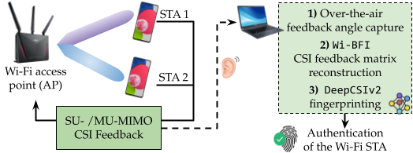

# DeepCSIv2
This is the implementation of the INFOCOM 25 Workshop's (DeepWireless 25) paper-- DeepCSIv2:[Radio Fingerprinting of Wi-Fi Devices Through
MIMO Compressed Channel Feedback](https://ieeexplore.ieee.org/abstract/document/11152893)


<br/>

### We present DeepCSIv2, a data-driven radio fingerprinting (RFP) algorithm to characterize Wi-Fi devices acting as stations (STAs) at the physical layer. DeepCSIv2 is based on a neural network architecture that automatically extracts the STA’s radio fingerprint from the feedback captured over the air and identifies the device.
<br/>

<p align="center">

</p>

If you find the project useful and you use this code, please cite our paper:
<br/>

```

@inproceedings{meneghello2025radio,
  title={Radio Fingerprinting of Wi-Fi Devices Through MIMO Compressed Channel Feedback},
  author={Meneghello, Francesca and Haque, Khandaker Foysal and Restuccia, Francesco},
  booktitle={IEEE INFOCOM 2025-IEEE Conference on Computer Communications Workshops (INFOCOM WKSHPS)},
  pages={1--6},
  year={2025},
  organization={IEEE}
}

```
<br/>
<br/>
